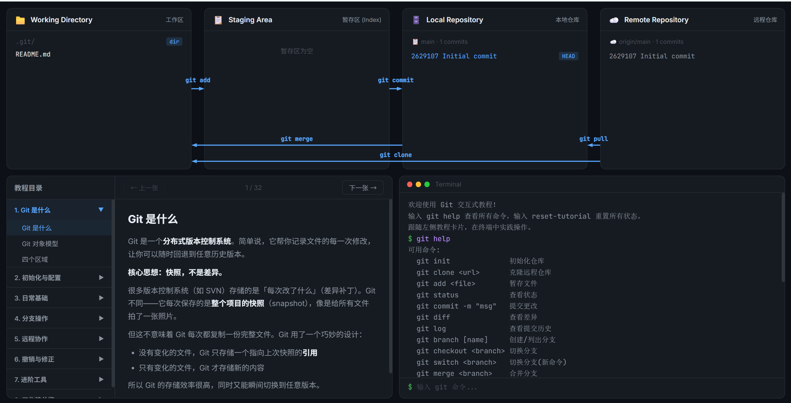

# Git-Interactive-Tutorial

**在线演示**: https://woyeyao.github.io/Git-Interactive-Tutorial/



新手友好的git的交互型入门中文教程。本作者也是小白，欢迎各位大佬指正，也欢迎新人体验。

当然，现在有AI了，学git不用钻研命令的格式参数，所以本项目重在促进理解一个git的大概过程，4个区是怎么联动的。之后还可以学习git graph之类的图形化界面，继续深入。

其它的git交互化项目：[Learn Git Branching](https://learngitbranching.js.org/?locale=zh_CN)一个闯关的git教程。

另外，我是看bilibili的up*玄离199*入门的，强推这个up

## 功能特点

- **4 区可视化** — Working Directory / Staging Area / Local Repo / Remote Repo 实时展示文件状态变化
- **模拟终端** — 支持 21 个 git 命令 + 辅助命令（touch、echo、cat），教学友好的错误提示
- **箭头动画** — 命令执行后永久显示对应的数据流向箭头
- **结构化教程** — 8 章 34 张卡片，从基础到进阶，每张卡片带动手任务
- **进度保存** — 自动保存到 localStorage，刷新不丢失
- **零依赖** — 纯 HTML/CSS/JS，无需构建工具、无需服务器

## 快速开始

直接双击 `index.html` 在浏览器中打开即可。

也可以访问 [在线演示](https://woyeyao.github.io/Git-Interactive-Tutorial/) 体验。

跟随左侧教程卡片，在右侧终端中输入命令，观察上方 4 个区域的变化。

## 教程目录

| 章节 | 内容 |
|------|------|
| 1. Git 是什么 | 对象模型、四个区域 |
| 2. 初始化与配置 | git init、git config、创建文件 |
| 3. 日常基础 | add、status、commit、diff、log |
| 4. 分支操作 | branch、checkout、switch、merge |
| 5. 远程协作 | SSH Key、clone、push、pull、fetch |
| 6. 撤销与修正 | reset、revert、restore |
| 7. 进阶工具 | rebase、stash、cherry-pick、tag、rm |
| 8. 工作流总览 | 日常流程、Git Flow、常见问题 |

## 项目结构

```
├── index.html          # 入口页面
├── style.css           # 全部样式
└── js/
    ├── app.js          # 入口、事件绑定、渲染编排
    ├── state.js        # GitState 核心状态管理
    ├── commands.js     # 所有命令 handler
    ├── parser.js       # 命令解析与分发
    ├── renderer.js     # 区域渲染、箭头动画、终端输出
    └── tutorials.js    # 教程卡片数据（8 章 34 张）
```

## 技术栈

- 纯 HTML / CSS / JS，无框架、无构建工具
- Google Fonts（Inter + JetBrains Mono）
- SVG 箭头动画
- localStorage 持久化

## License

MIT
